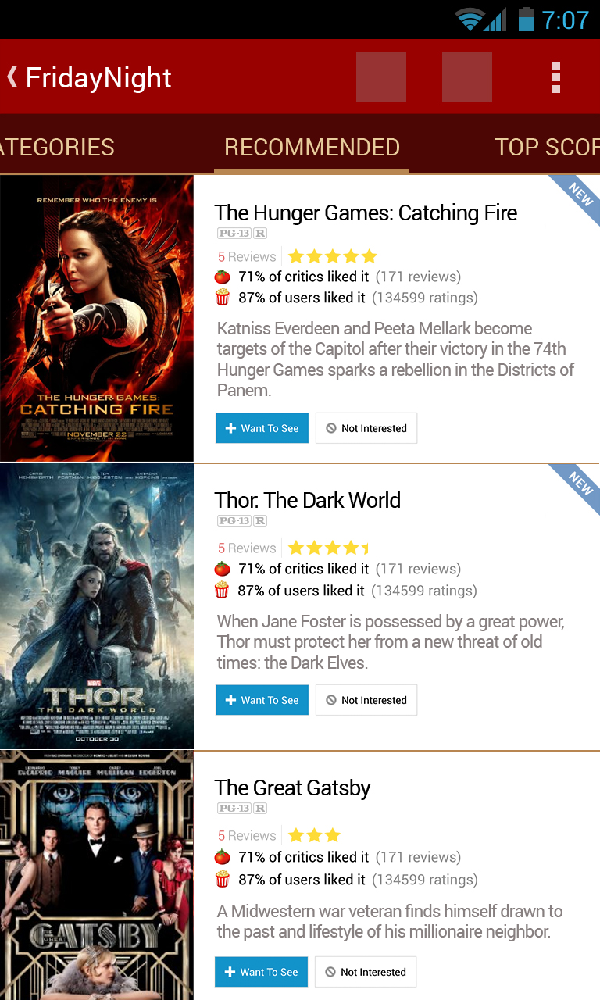

# FridayNight - Recommend your Friday night movie

## User Stories

1. Top 250 movies from IMDB, intersect that with what's available on Netflix – makes one screen/feature. Show IMDB rating of each in the list.
2. Recent movies, i.e., from 2013, sorted by popularity, depending on what's available on Netflix – another screen/feature.
3. Netflix popular, vs IMDB rating of each – another screen/feature.
4. Just random - what to watch today (Based on Netflix, IMDB, popular that week, vs IMDB rating) – yet another screen/feature.

Also, we would fetch ratings from both IMDB and Rotten Tomatoes.
